```mermaid
flowchart TD
    subgraph Input
        PDF["PDF File"]
        CLI["CLI: python main.py"]
        HTTP["Browser: documents upload"]
    end

    subgraph DocumentProcess["document_process - Stage 1 PDF to Artifacts"]
        DL["DocumentLoaderService: load and copy PDF"]
        OCR["OCRService: PaddleOCR cached singleton"]
        RO["ReadingOrderService: resolve block order"]
        LD["LayoutDetectionService: PP DocLayout cached singleton"]
        AS["AssociationService: link text to regions"]
        CR["CroppingService: crop tables and figures"]
        VLM["VLM Enrichment: gpt-4o"]
        ARTS["Frozen Artifacts: document json, chunks json, crops"]
    end

    subgraph RAG["rag - Stage 2 Artifacts to Index to Answer"]
        CH["chunk.py: ProcessedChunk to ChunkRecord"]
        EM["embed.py: OpenAI text embedding 3 small"]
        VS{"VectorStore"}
        JVS["JsonVectorStore: store json"]
        CVS["ChromaVectorStore"]
        QA["qa.py: gpt-4.1-mini QAResponse and sources"]
    end

    subgraph API["api - FastAPI HTTP Layer"]
        APP["create_app factory"]
        AUTH["auth endpoints: JWT and OAuth"]
        DR["documents endpoints: upload, list, delete"]
        QR["query endpoint: RAG pipeline"]
        CV["conversations endpoint: history"]
        UI["Static Frontend"]
    end

    subgraph DB["RDS PostgreSQL"]
        USERS[("users")]
        TOKENS[("refresh_tokens")]
        CONVOS[("conversations")]
        MSGS[("messages")]
    end

    subgraph Infra["AWS Infrastructure"]
        S3[("S3: artifacts and vectorstore")]
        ECS["ECS Fargate: 2 vCPU and 8 GB"]
        ALB["ALB: idle timeout 600s"]
        SM["Secrets Manager"]
    end

    PDF --> CLI
    PDF --> DR
    CLI --> DL
    DR --> DL

    DL --> OCR
    OCR --> RO
    RO --> LD
    LD --> AS
    AS --> CR

    CR --> VLM
    VLM --> ARTS
    CR --> ARTS

    ARTS --> CH
    CH --> EM
    EM --> VS
    VS -->|default| JVS
    VS -->|optional| CVS
    JVS --> QA
    CVS --> QA

    APP --> AUTH
    APP --> DR
    APP --> QR
    APP --> CV
    APP --> UI

    QR --> QA
    AUTH --> USERS
    AUTH --> TOKENS
    QR --> CONVOS
    QR --> MSGS
    CV --> CONVOS
    CV --> MSGS

    ARTS <-->|sync| S3
    JVS <-->|sync| S3
    ECS --> APP
    ALB --> ECS
    SM -->|inject at startup| ECS
```

# PDF RAG — Document Q&A

Upload PDFs, run OCR + layout detection, build a vector index, and ask questions grounded in your documents. Supports multi-user accounts with persistent chat history, Google OAuth, and production deployment on AWS ECS Fargate.

---

## Table of Contents

- [Local Setup](#local-setup)
- [Common Commands](#common-commands)
- [Application Architecture](#application-architecture)
- [Infrastructure Architecture (AWS)](#infrastructure-architecture-aws)
- [Request Flows](#request-flows)
- [Upload & Processing](#upload--processing)
- [Deployment Checklist](#deployment-checklist)

---

## Local Setup

```bash
python3.11 -m venv .venv
source .venv/bin/activate
pip install -r requirements.txt        # full runtime (includes Paddle ~3.5 GB)
pip install -r requirements-dev.txt    # CI/test deps (no Paddle)
cp .env.example .env                   # fill in OPENAI_API_KEY and JWT_SECRET_KEY
```

**Required env vars:** `OPENAI_API_KEY`, `JWT_SECRET_KEY`
**Optional:** `OPENAI_BASE_URL`, `GOOGLE_CLIENT_ID`, `GOOGLE_CLIENT_SECRET`

---

## Common Commands

```bash
# API server (local)
python main.py --serve                 # starts FastAPI on http://localhost:8000

# CLI pipeline (batch use)
python main.py --preprocess            # OCR + freeze artifacts from data/raw/
python main.py --index                 # build vector index from frozen artifacts
python main.py --ask "your question"   # query against the index

# Docker
docker-compose up --build              # first build (~20 min — downloads Paddle models)
docker-compose up                      # subsequent starts

# Tests
pytest                                 # run all tests
pytest tests/unit/test_chunk.py        # run a single test file

# Lint
ruff check .
ruff format .
```

---

## Application Architecture

### Frontend (Browser)

```
Browser
  │
  ├── GET  /              → index.html  (main app)
  ├── GET  /login         → login.html  (auth page)
  └── GET  /static/*      → CSS, JS modules
        │
        ├── app.js            orchestrates all modules, holds JWT in memory only
        ├── sidebar.js        document library (upload, select, delete)
        ├── query.js          chat interface, question submission, conversation tracking
        └── conversations.js  sidebar history list (load, delete, new chat)
```

### Backend (FastAPI)

```
FastAPI  api/app.py  (create_app factory)
  │
  ├── /auth/*                 auth.py
  │     ├── POST /register            email + password sign-up
  │     ├── POST /login               email + password login → JWT + HttpOnly refresh cookie
  │     ├── POST /refresh             rotate access token via refresh cookie (silent re-auth)
  │     ├── POST /logout              revoke refresh token
  │     ├── GET  /oauth/google        redirect to Google consent screen
  │     └── GET  /oauth/google/callback  exchange code → upsert user → issue JWT
  │
  ├── /documents/*            documents.py
  │     ├── POST /documents/upload    save PDF → spawn background OCR thread → return immediately
  │     ├── GET  /documents/status/{id}  poll job progress (preprocessing → indexing → ready)
  │     ├── GET  /documents           list all documents (in-progress + ready)
  │     └── DELETE /documents/{id}   delete document + S3 artifacts
  │
  ├── /query                  query.py
  │     └── POST /query       embed question → retrieve chunks → rerank → GPT answer
  │                           saves user message before RAG, assistant message + sources after
  │                           returns conversation_id so follow-ups append to same thread
  │
  ├── /conversations/*        conversations.py
  │     ├── GET  /conversations              list user's conversations (newest first + preview)
  │     ├── GET  /conversations/{id}/messages  full message history for one conversation
  │     └── DELETE /conversations/{id}      delete conversation and all its messages
  │
  └── /health                 health.py  (ALB health checks — always fast, never blocked)
```

### Database Schema (RDS PostgreSQL)

```
users
  id (uuid PK) · email (unique) · hashed_password · oauth_provider · oauth_sub
  created_at · is_active

refresh_tokens
  token_hash (PK) · user_id → users.id · expires_at
  (rotated on every use — old token deleted, new one issued)

conversations
  id (uuid PK) · user_id → users.id · title (first question, truncated) · created_at
  (scoped to user — users only ever see their own conversations)

messages
  id (uuid PK) · conversation_id → conversations.id · role (user|assistant)
  content · sources (JSON array of retrieved chunks) · created_at
```

### RAG Pipeline (inside /query)

```
POST /query  { question, doc_filter[], conversation_id }
        │
        ├── 1. Verify JWT → extract user_id
        ├── 2. Save user message to DB  (before RAG — never silently lost)
        ├── 3. Embed question           OpenAI text-embedding-3-small
        ├── 4. Vector search            JsonVectorStore (or ChromaDB)
        ├── 5. Rerank + compress        LLM reranker, context compression
        ├── 6. Generate answer          GPT-4.1-mini with retrieved context
        ├── 7. Save assistant message + sources to DB
        └── 8. Return { answer, sources[], conversation_id }
```



---

## Infrastructure Architecture (AWS)

Three CDK stacks deployed in order: Network → Database → App.

```
┌─────────────────────────────────────────────────────────────────────┐
│                         AWS  ca-central-1                           │
│                                                                     │
│  ┌──────────────────────────────────────────────────────────────┐   │
│  │  CDK Stack 1: RagAgentNetwork                                │   │
│  │                                                              │   │
│  │  VPC (10.0.0.0/16)                 No NAT Gateways          │   │
│  │  ┌─────────────────────┐  ┌──────────────────────────────┐  │   │
│  │  │  Public Subnet AZ-a │  │  Private Isolated Subnet AZ-a│  │   │
│  │  │  ALB + ECS tasks    │  │  RDS PostgreSQL              │  │   │
│  │  └─────────────────────┘  └──────────────────────────────┘  │   │
│  │  ┌─────────────────────┐  ┌──────────────────────────────┐  │   │
│  │  │  Public Subnet AZ-b │  │  Private Isolated Subnet AZ-b│  │   │
│  │  │  ALB + ECS tasks    │  │  RDS standby                 │  │   │
│  │  └─────────────────────┘  └──────────────────────────────┘  │   │
│  │                                                              │   │
│  │  No NAT Gateways saves ~$73/month vs standard VPC setup     │   │
│  │  ECS uses assign_public_ip=True instead (same security)     │   │
│  └──────────────────────────────────────────────────────────────┘   │
│                                                                     │
│  ┌──────────────────────────────────────────────────────────────┐   │
│  │  CDK Stack 2: RagAgentDatabase                               │   │
│  │                                                              │   │
│  │  RDS PostgreSQL 15   db.t3.micro   20 GB storage            │   │
│  │  AWS Free Tier eligible (first 12 months)                   │   │
│  │                                                              │   │
│  │  Tables (auto-created on container startup):                 │   │
│  │  ┌────────────────────────────────────────────────────┐     │   │
│  │  │  users · refresh_tokens · conversations · messages │     │   │
│  │  └────────────────────────────────────────────────────┘     │   │
│  │                                                              │   │
│  │  termination_protection = ON                                 │   │
│  │  removal_policy = RETAIN                                     │   │
│  │  Password auto-generated → stored in Secrets Manager        │   │
│  └──────────────────────────────────────────────────────────────┘   │
│                                                                     │
│  ┌──────────────────────────────────────────────────────────────┐   │
│  │  CDK Stack 3: RagAgentApp                                    │   │
│  │                                                              │   │
│  │  Internet  (HTTPS :443)                                      │   │
│  │      │                                                       │   │
│  │      ▼                                                       │   │
│  │  ┌─────────────────────────────────────────────────────┐    │   │
│  │  │  Application Load Balancer                          │    │   │
│  │  │  idle_timeout = 600s  (covers slow PDF OCR jobs)    │    │   │
│  │  │  HTTP → HTTPS redirect                              │    │   │
│  │  └──────────────────────┬──────────────────────────────┘    │   │
│  │                         │ Port 8000                         │   │
│  │                         ▼                                   │   │
│  │  ┌─────────────────────────────────────────────────────┐    │   │
│  │  │  ECS Fargate Service                                │    │   │
│  │  │  2 vCPU · 8 GB RAM · X86_64                        │    │   │
│  │  │  desired_count: 0 by default (free when idle)       │    │   │
│  │  │  Auto-scale: CPU 60% target · min 0 · max 4         │    │   │
│  │  │  Health check: GET /health every 30s                │    │   │
│  │  └──────────┬──────────────────────┬───────────────────┘    │   │
│  │             │                      │                        │   │
│  │             ▼                      ▼                        │   │
│  │  ┌──────────────────┐  ┌──────────────────────────────┐    │   │
│  │  │  S3 Bucket       │  │  Secrets Manager             │    │   │
│  │  │  PDF raw files   │  │  OPENAI_API_KEY              │    │   │
│  │  │  OCR artifacts   │  │  JWT_SECRET_KEY              │    │   │
│  │  │  Vector store    │  │  DATABASE_URL                │    │   │
│  │  │  SSE + versioned │  │  GOOGLE_CLIENT_ID            │    │   │
│  │  └──────────────────┘  │  GOOGLE_CLIENT_SECRET        │    │   │
│  │                        └──────────────────────────────┘    │   │
│  │                                                              │   │
│  │  ECR  (Docker image registry, 5-image lifecycle rule)        │   │
│  └──────────────────────────────────────────────────────────────┘   │
└─────────────────────────────────────────────────────────────────────┘
```

### Cost Summary (ca-central-1, learning setup)

| Service | Always-on cost | When active |
|---|---|---|
| RDS db.t3.micro | ~$0 (Free Tier) or ~$25/mo | always running |
| ECS Fargate (desired=0) | $0 | $0.10–0.20/hr when scaled up |
| ALB | ~$20/mo | included |
| S3 | ~$0.03/GB | negligible |
| Secrets Manager | ~$0.40/secret/mo × 5 | ~$2/mo |
| **Idle total** | **~$25–37/mo** | |

Scale up with `./scripts/up.sh`, scale to zero with `./scripts/down.sh`.

---

## Request Flows

### Ask a Question

```
User types question in browser
        │
        ▼
  query.js  POST /query  { question, doc_filter[], conversation_id }
        │
        ▼
  JWT verified (Authorization: Bearer <token>)
        │
        ├── DB: save user message  ──────────────────────────────────┐
        │   (saved BEFORE RAG — never silently lost on failure)      │
        │                                                       RDS PostgreSQL
        ├── embed question          OpenAI text-embedding-3-small    │
        ├── vector search           JsonVectorStore (S3-synced)      │
        ├── rerank + compress       LLM reranker, context window     │
        ├── generate answer         GPT-4.1-mini                     │
        │                                                            │
        ├── DB: save assistant message + sources  ───────────────────┘
        │
        ▼
  Response: { answer, sources[], conversation_id }
        │
        ▼
  query.js renders chat bubble
  conversations.js refreshes sidebar with updated history
```

### Google Sign-In

```
Browser              FastAPI              Google              RDS
   │                    │                    │                 │
   │── click Google ──► │                    │                 │
   │                    │── redirect ───────►│                 │
   │◄───────────────────────────────────────│                 │
   │── user approves ──────────────────────►│                 │
   │◄── auth code ───────────────────────── │                 │
   │                    │◄── code ──────────│                 │
   │                    │── exchange ───────►│                 │
   │                    │◄── email + sub ─── │                 │
   │                    │── upsert user ─────────────────────►│
   │                    │◄───────────────────────────────────  │
   │                    │── issue JWT + set HttpOnly cookie     │
   │◄── redirect / ─── │                    │                 │
   │  app.js stores     │                    │                 │
   │  token in memory   │                    │                 │
   │  (never localStorage)                   │                 │
```

### Token Lifecycle

```
Login / OAuth callback
  └── access_token (15 min JWT)   → stored in JS memory only
  └── refresh_token (7 days)      → HttpOnly cookie (JS cannot read)

Every API call:  Authorization: Bearer <access_token>

Token expired (401)?
  └── app.js calls POST /auth/refresh automatically
        └── server reads HttpOnly cookie, issues new pair
        └── old refresh token deleted (rotation — theft detection)

Logout:
  └── POST /auth/logout deletes refresh token from DB + clears cookie
```

---

## Upload & Processing

### How long uploads are handled

PDF OCR takes 2–5 minutes for a large document. The upload endpoint returns immediately and the pipeline runs in a background thread, so the browser never hangs.

```
Browser                    FastAPI                  Background Thread
   │                          │                            │
   │── POST /upload ─────────►│                            │
   │                          │  save PDF to disk          │
   │                          │  register job in memory    │
   │                          │  spawn thread ────────────►│
   │◄── 200 { document_id,    │                            │ OCRService (cached singleton)
   │          status:         │                            │ LayoutDetection (cached singleton)
   │          "preprocessing"}│                            │ build chunks
   │                          │                            │ OpenAI embeddings
   │── GET /status/{id} ─────►│                            │ sync to S3
   │◄── { status: "indexing" }│                            │
   │                          │                            │ jobs[id].status = "ready"
   │── GET /status/{id} ─────►│                            │
   │◄── { status: "ready",    │                            │
   │     chunk_count: 142,    │                            │
   │     page_count: 48 }     │                            │
```

### Memory protection

- **Paddle models are cached singletons** — `@lru_cache(maxsize=1)` on both `_get_paddle_ocr()` and `_get_paddle_layout_detector()`. Models load once per process (~1.4 GB total), shared across all uploads.
- **One OCR job at a time** — `threading.Semaphore(1)` in `_run_pipeline`. A second upload queues automatically and starts when the first finishes. Prevents two pipelines from doubling memory usage and OOM-ing the 8 GB container.
- **ALB idle_timeout = 600s** — covers the edge case where a user keeps the browser tab open watching a large PDF process. Without this the ALB cuts the connection after 60s.

### Memory budget (single upload)

```
8 GB Fargate container
  ├── OS + Python runtime        ~300 MB
  ├── PaddleOCR model            ~800 MB  (singleton, loaded once)
  ├── LayoutDetection model      ~600 MB  (singleton, loaded once)
  ├── Active page image in RAM   ~14–54 MB  (at render_scale=3.0)
  └── OCR text results           ~small

Single upload peak:    ~1.7 GB  ✅
Two concurrent jobs:   queued — second waits for semaphore  ✅
```

---

## Deployment Checklist

### Before first deploy

```bash
# 1. Create all secrets in AWS Secrets Manager
chmod +x scripts/create-secrets.sh
./scripts/create-secrets.sh
# Prompts for: OPENAI_API_KEY, GOOGLE_CLIENT_ID/SECRET, RDS password

# 2. Add your ALB domain as an authorized redirect URI in Google Cloud Console
#    APIs & Services → Credentials → your OAuth 2.0 Client
#    Add: https://<your-alb-domain>/auth/oauth/google/callback

# 3. Deploy all three CDK stacks
cd cdk
pip install -r requirements.txt
cdk bootstrap   # first time only
cdk deploy --all

# 4. Scale ECS from 0 to 2 containers
cd ..
./scripts/up.sh
```

### Day-to-day

```bash
./scripts/up.sh     # start containers (ECS desired_count=2)
./scripts/down.sh   # stop containers  (ECS desired_count=0, Fargate = $0)
```

### CI/CD (GitHub Actions)

| Workflow | Trigger | What it does |
|---|---|---|
| `ci.yml` | every push | ruff lint, unit tests, Docker build check |
| `deploy.yml` | push to `main` | build image → push to ECR → update ECS task → health-check rollout |

---

## Detection Notes

The preprocessing pipeline uses:

- `pypdfium2` for PDF page rendering (render_scale=3.0 by default)
- PaddleOCR (`PP-OCRv4_mobile`) for text extraction and bounding boxes
- Paddle `LayoutDetection` (`PP-DocLayout_plus-L`) for text blocks, tables, figures
- Reading order resolved from OCR bounding box positions
- Optional GPT-4o vision enrichment for table/figure regions (`USE_VLM_SUMMARIES=true`)

Important notes:

- First run downloads Paddle models into the configured `PADDLE_CACHE_DIR`
- `enable_mkldnn=False` is required on x86 CPU — workaround for PaddlePaddle 3.3.x regression ([issue #77340](https://github.com/PaddlePaddle/Paddle/issues/77340))
- The only LLM backend is OpenAI (embeddings + generation)
